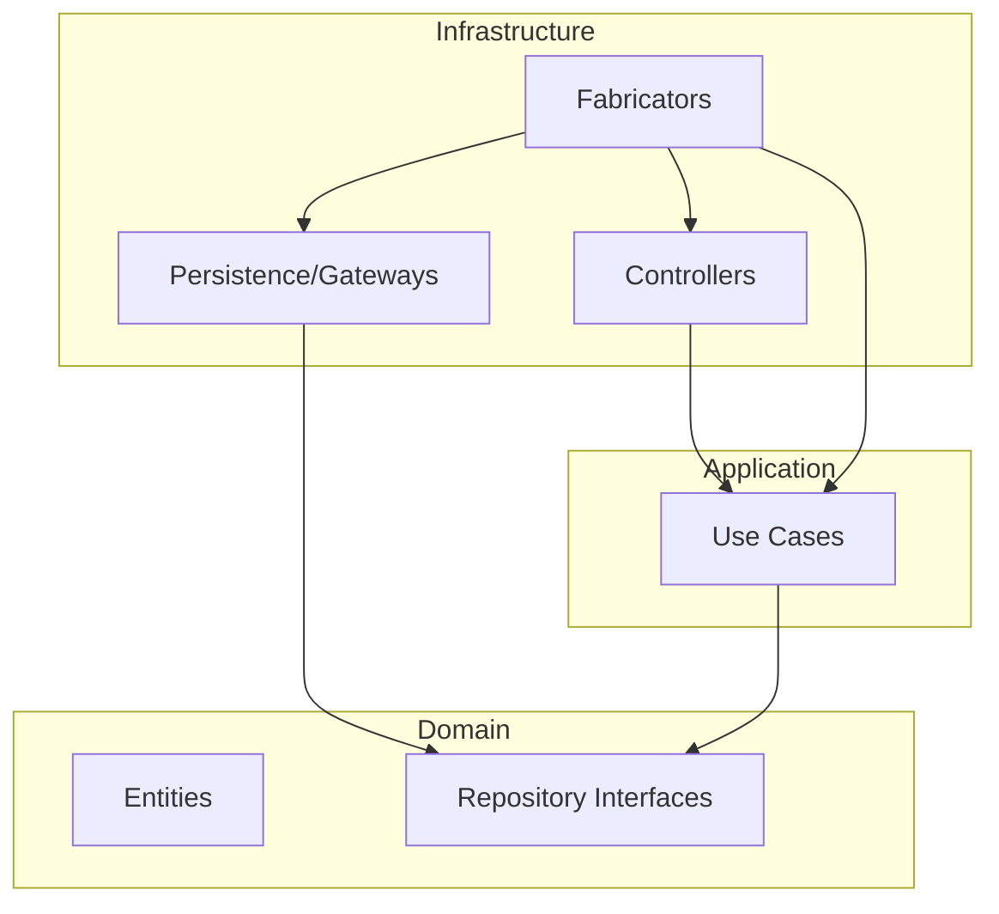

# Clean Architecture Review (Manual DI with Fabricators)

This document provides an updated analysis of the project's structure, which has been refactored to use manual dependency injection with a "fabricator" pattern, in alignment with Clean Architecture principles.

## Core Principles

The main goal of Clean Architecture is the **separation of concerns**. This is achieved by organizing the code into independent layers with a strict dependency rule: **dependencies can only point inwards**.

- **Domain:** The innermost layer, containing the core business logic and entities. It is the most stable and independent part of the application.
- **Application:** This layer orchestrates the use cases of the application. It depends on the Domain layer but has no knowledge of the outer layers (like the database or UI).
- **Infrastructure:** The outermost layer, containing all the implementation details, such as frameworks, databases, and external services. This layer is the most volatile and depends on the inner layers.

## Project Structure Analysis

The new project structure reflects these principles well, with the addition of the fabricator pattern for manual dependency injection.

### 1. Domain Layer (`src/Domain`)

This layer remains the core of the application and is unchanged.

- **`Entities`**: Pure business objects (e.g., `News`, `DiscordCommand`).
- **`Repositories`**: Interfaces (`INewsRepository`, `IDiscordCommandRepository`) defining data access contracts.

**Result:** This layer is well-defined and has no dependencies on the other layers, which is correct.

### 2. Application Layer (`src/Application`)

This layer contains the application-specific business rules.

- **`UseCases`**: Classes (e.g., `GetLatestNewsUseCase`, `PingCommandUseCase`) that implement the specific use cases. They depend on the repository interfaces from the Domain layer.

**Result:** This layer correctly depends only on the Domain layer.

### 3. Infrastructure Layer (`src/Infrastructure`)

This is the outermost layer, where all the implementation details and the new fabricator pattern reside.

- **`Persistence` & `Gateways`**: Concrete implementations of the repository interfaces (e.g., `NewsRepository`, `DiscordCommandRepository`).
- **`Controllers`**: Adapters that connect the web framework (Express.js) and the Discord client to the application's use cases.
- **`Fabricators`**: This is the key to the new manual DI pattern. Each fabricator is a simple factory responsible for creating a single class and its dependencies. For example, `GetLatestNewsUseCaseFabricator.js` creates the `NewsRepository` (by calling its fabricator) and then injects it into a new `GetLatestNewsUseCase` instance. This pattern centralizes the instantiation logic for each component, making the dependency graph explicit and easy to follow.

**Result:** This layer correctly depends on the Application and Domain layers. The fabricator pattern provides a clear and maintainable way to manage dependencies without an external library.

## Dependency Flow Diagram

The dependency flow remains the same, with all dependencies pointing inwards. The fabricators act as the "glue" that wires the layers together.

## Final Review and Conclusion

The project is now in an excellent state. It correctly implements Clean Architecture principles with a clear and maintainable manual dependency injection strategy.

**Key Strengths:**

- **Clear Separation of Concerns:** The layers are well-defined and independent.
- **Inverted Dependencies:** The Domain layer defines interfaces, and the Infrastructure layer implements them, respecting the Dependency Inversion Principle.
- **Explicit Dependency Management:** The fabricator pattern makes it very clear how each component is created and what its dependencies are.
- **No External DI Library:** The project is now free of external DI libraries like `awilix`, reducing complexity and potential points of failure.

The architecture is robust, scalable, and testable. You have a solid foundation for building out the rest of your application's features.